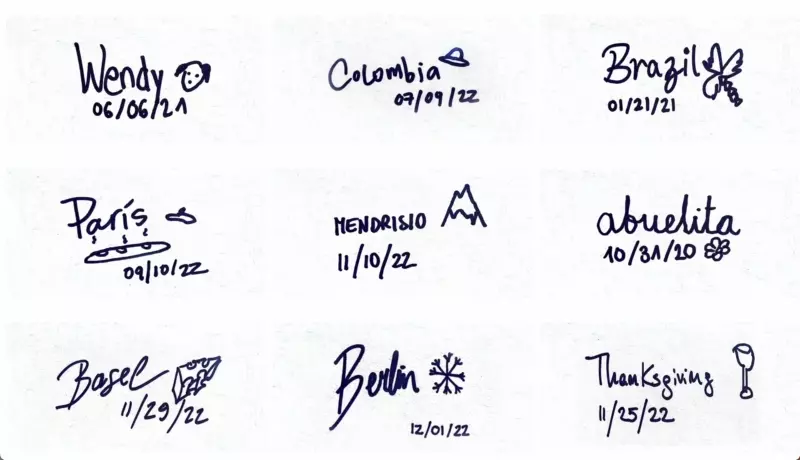
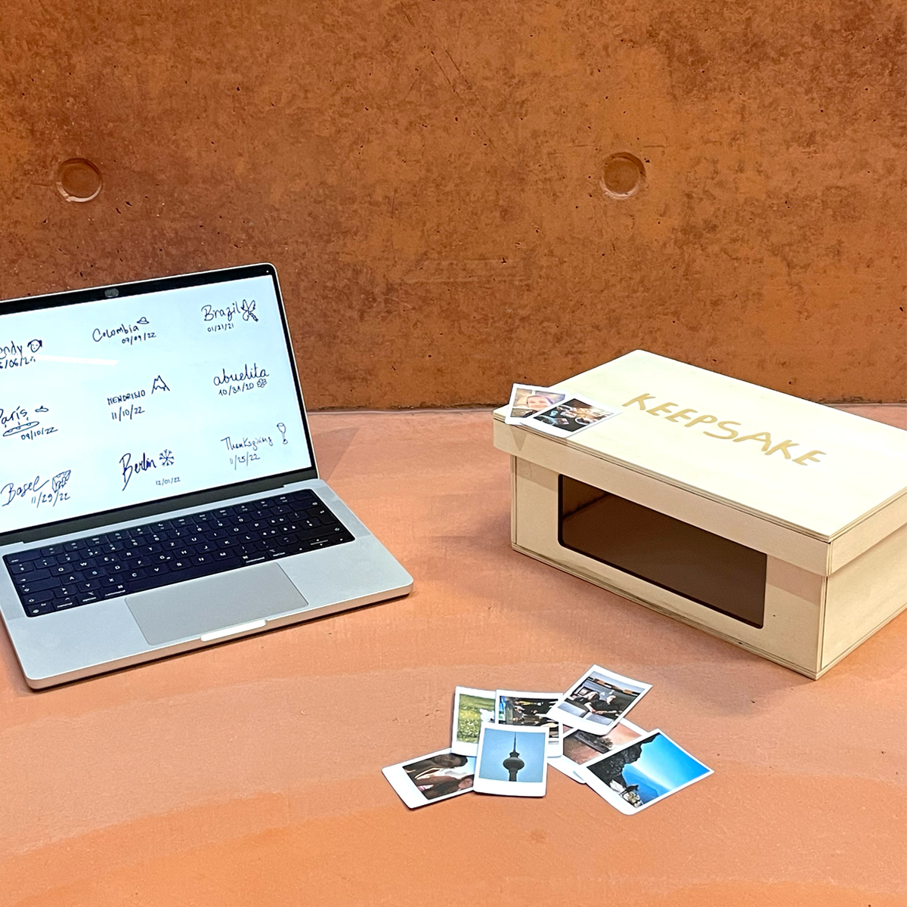
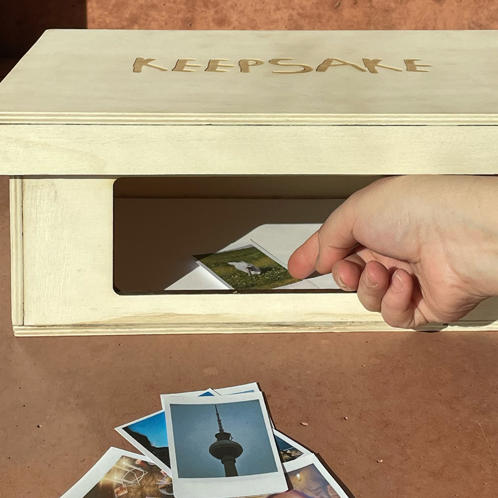
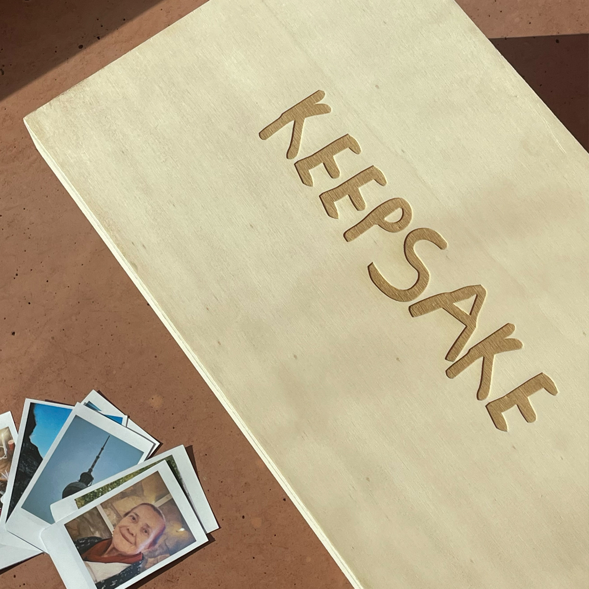
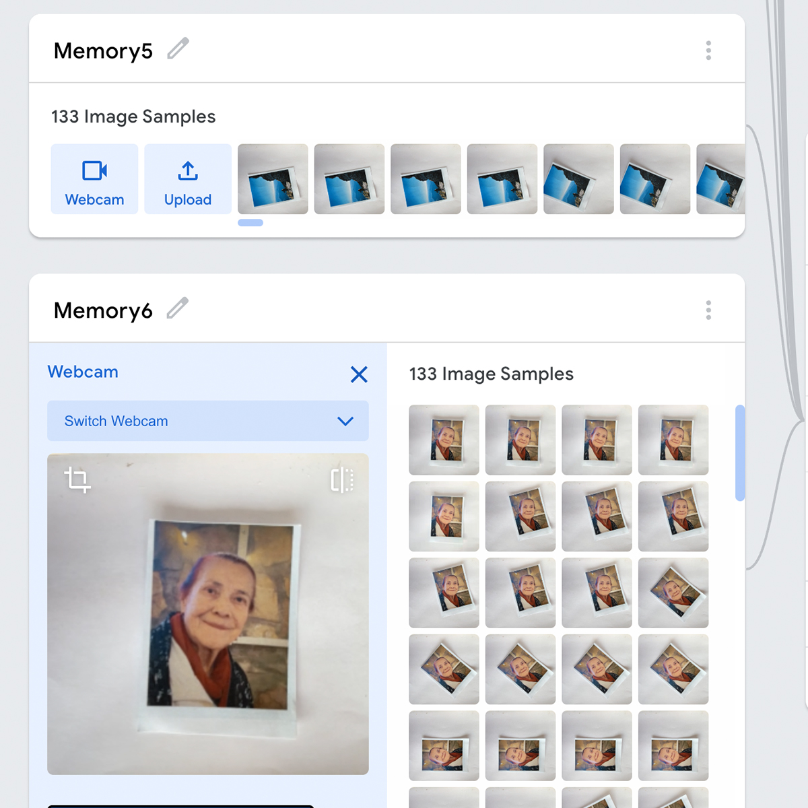

# Keepsake

Your special moments deserve to be captured and relived - but why keep it at just photos in a box or photo book? Keepsake stores mementos in an upscale version of the classic shoebox - known to be the perfect size for cherished memorabilia. The device utilizes a trained neural network to recognize photos from the past and bring them to life. Users can place a photograph inside the box to let Keepsake scan and classify the image. If the AI is confident (>0.98) that a picture is part of the user's pre-trained memories, it will project the belonging memories onto a screen. This project was developed by Sara Kashir, Camila Mendez and me as part of a course led by [Matteo Loglio](https://matlo.me/).

The P5 sketch, pre-trained neural network and other assets are stored in the folder `assets`.

## Interface

Keepsake's interface is divided into two - The first part is a screen showcasing the pre-trained memories, and the second is our reinvented shoebox, which has a hole to place photos and a camera that will scan the images.

### Screen

### Shoebox

## Images

